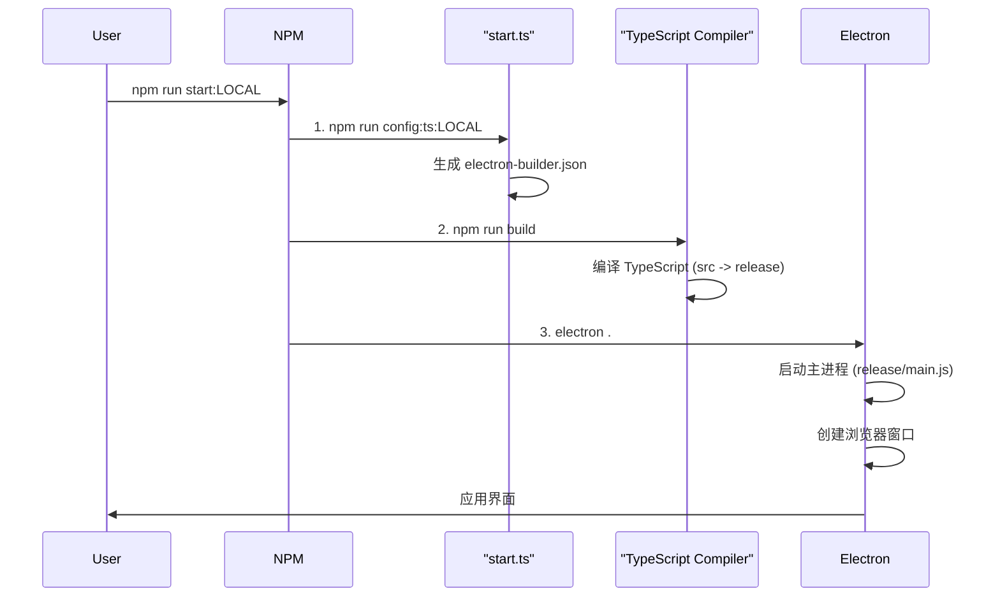

# Electron Builder 启动时序图

本-文档详细说明了在使用 `electron-builder` 工作流时，通过 `npm run start:ENV` 命令启动应用的完整流程。

## 📊 完整启动时序图

## 📝 步骤详解

1.  **用户命令**: 用户执行 `npm run start:LOCAL` (或其他环境) 来启动应用。

2.  **配置生成**: NPM 首先执行 `npm run config:ts:LOCAL`。
    *   `start.ts` 脚本被调用，它会读取 `env/common.json` 和特定环境的配置文件 (如 `env/LOCAL.json`)。
    *   脚本合并这些配置，并根据模板生成一个 `electron-builder.json` 文件。

3.  **编译代码**: NPM 接着执行 `npm run build`。
    *   该命令会运行 `tsc`，将 `src/` 目录下的 TypeScript 源码编译成 JavaScript，并输出到 `release/` 目录。
    *   同时，它也会复制必要的静态文件 (如 `index.html`) 到 `release/` 目录。

4.  **启动应用**: 最后，NPM 执行 `electron .`。
    *   Electron 启动，并执行 `package.json` 中 `main` 字段指定的主进程文件 (`release/main.js`)。
    *   主进程创建浏览器窗口并加载应用界面，完成启动。

这个流程确保了每次启动应用时，都会使用对应环境的最新配置，并且代码是最新编译的。
