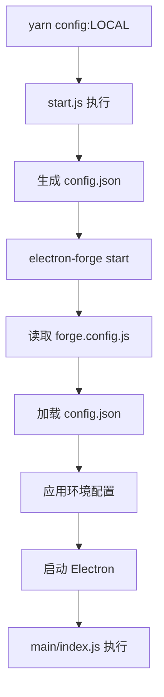

# forge.config.js 配置文件详细解析

## 🎯 配置文件的核心作用

你的 `forge.config.js` 是 electron-forge 的**中央控制配置**，定义了开发、打包、发布的全流程参数。

## 📋 配置结构详解

### 1️⃣ 动态配置加载

```javascript
let config = require('./config.json')
```

**关键特性**：
- 依赖于 `start.js` 生成的 `config.json`
- 实现环境相关的动态配置
- 在 forge 启动时读取当前环境配置

**启动时的执行顺序**：
```bash
yarn config:LOCAL          # 生成 config.json
    ↓
electron-forge start       # 读取 config.json
    ↓  
应用环境特定配置          # 使用配置启动应用
```

### 2️⃣ 发布目标配置 (publish_targets)

```javascript
"publish_targets": {
  "darwin": ["nucleus-uploader"],   // macOS 发布
  "win32": ["nucleus-uploader"],    // Windows 发布  
  "linux": ["nucleus-uploader"]     // Linux 发布
}
```

**作用**：
- 定义各平台的发布方式
- 统一使用自定义的 nucleus-uploader
- 支持你们的内部更新服务器

### 3️⃣ Nucleus 更新服务器配置

```javascript
"nucleus": {
  "host": "http://nucleus.bm.bwoilmarine.com",
  "appId": "1", 
  "channelId": config.CHANNEL_ID,    // 动态环境通道
  "token": process.env.NUCLEUS_TOKEN
}
```

**核心功能**：
- 连接到你们的私有更新服务器
- 根据环境使用不同的 `CHANNEL_ID`：
  - LOCAL: `36545cd21295b745e13e5b03840f7d0c`
  - DEV/SIT/UAT/PROD: 各自独立的通道ID
- 支持自动更新推送

### 4️⃣ 打包目标配置 (make_targets)

```javascript
"make_targets": {
  "darwin": ["zip", "dmg"],         // macOS: ZIP + DMG 安装包
  "linux": ["deb", "rpm"]           // Linux: DEB + RPM 包
}
```

**平台特定打包**：
- **macOS**: 生成 ZIP（便于分发）+ DMG（标准安装包）
- **Linux**: 支持 Debian 系 + RedHat 系
- **Windows**: 通过 electron-builder 处理（NSIS）

### 5️⃣ 核心打包配置 (electronPackagerConfig)

```javascript
"electronPackagerConfig": {
  "asar": true,                     // 启用 ASAR 打包
  "name": config.PRODUCT_NAME,      // 动态产品名称
  "packageManager": "yarn",         // 使用 Yarn
  "icon": config.API_ENV === 'PROD' ? 
    "assets/mol" : 
    `assets/mol-${config.API_ENV}`,  // 环境相关图标
  "extendInfo": "Info.plist",       // macOS 扩展信息
  "executableName": "BMOMiddleOffice",
  "appBundleId": config.appBundleId, // 动态 Bundle ID
  "osxSign": {
    "identity": "4622673C3DE6E801CA02D714B4C3CA2E8A48D497"
  }
}
```

## 🚀 在 electron-forge start 中的作用

### 开发阶段配置应用

```javascript
// forge start 时，这些配置影响开发环境：

1. 图标选择：
   - LOCAL → assets/mol-DEV
   - PROD → assets/mol
   
2. 应用标识：
   - name: "Middle Office - LOCAL"
   - bundleId: "com.emarineonline.mo.local"
   
3. 代码组织：
   - asar: true (但开发时不实际打包)
   - packageManager: yarn (依赖管理)
```

### 环境差异化处理

```bash
# 不同环境启动时的差异：

LOCAL 环境:
├── 产品名: "Middle Office - LOCAL"  
├── 图标: assets/mol-DEV
├── Bundle ID: com.emarineonline.mo.local
└── 通道ID: 36545cd21295b745e13e5b03840f7d0c

PROD 环境:
├── 产品名: "Middle Office"
├── 图标: assets/mol  
├── Bundle ID: com.emarineonline.mo
└── 通道ID: [生产环境通道ID]
```

## 🔄 动态配置的工作流程

### 完整启动链条



### 配置文件依赖关系

```javascript
// 文件依赖链：
env/LOCAL.json          // 环境基础配置
    ↓
start.js               // 配置处理器  
    ↓
config.json           // 运行时配置
    ↓
forge.config.js       // Forge 配置
    ↓
main/index.js         // 应用入口
```

## 🛠️ 实际开发中的影响

### 1. 应用外观
```javascript
// 根据环境显示不同图标和标题
if (config.API_ENV === 'LOCAL') {
  // 显示 mol-DEV 图标
  // 标题栏显示 "Middle Office - LOCAL"
}
```

### 2. 更新通道隔离
```javascript
// 不同环境接收不同的更新
LOCAL 环境 → 不接收自动更新
DEV 环境   → 接收开发版本更新  
PROD 环境  → 接收生产版本更新
```

### 3. 代码签名（macOS）
```javascript
// 自动应用数字签名
"osxSign": {
  "identity": "4622673C3DE6E801CA02D714B4C3CA2E8A48D497"
}
```

## 🎯 配置的优势

### 统一管理
- 一个配置文件控制全流程
- 环境差异化自动处理
- 开发和生产配置分离

### 自动化程度高
- 图标自动选择
- 签名自动应用  
- 更新通道自动路由

### 企业级特性
- 私有更新服务器
- 代码签名支持
- 多平台构建支持

这个配置让你的 BMO-MO-APP 可以轻松管理多环境开发和部署！